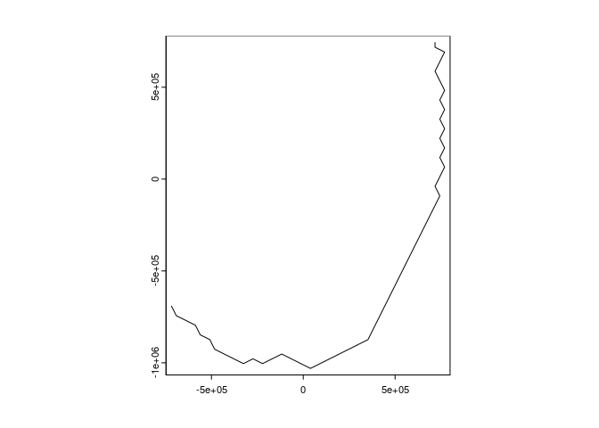

<!-- README.md is generated from README.Rmd. Please edit that file -->

# noswimming

<!-- badges: start -->
<!-- badges: end -->

The goal of noswimming is to prevent animals from leaving the ocean.
(i.e. swimming on land is not allowed)

## WIP

The name isn’t very serious, or accurate, or what we want. TBD

## Installation

You can install the development version of noswimming like so:

``` r
## install.packages("remotes")
remotes::install_github("mdsumner/noswimming")
```

## Example

This is a basic example which finds the least cost path around land (we
get a topographic dataset under the hood to figure this out).

``` r
library(noswimming)
#pt <- cbind(c(-90, 90), c(-70, -60))
pt <- cbind(c(138, 153),  c(-36, -23))
path <- lcp(pt)

library(terra)
#> terra 1.7.81
```

``` r
## we get the data in the projection use
plot(path)
```



``` r
## so reproject for longlat use
plot(terra::project(path, "EPSG:4326"), lty = 2, col = "firebrick")
maps::map(add = TRUE)
```


To turn `path` into longlat, do this:

``` r
ll <- terra::geom(terra::project(path, "EPSG:4326"))[,c("x", "y")]
str(ll)
#>  num [1:55, 1:2] 138 138 139 139 140 ...
#>  - attr(*, "dimnames")=List of 2
#>   ..$ : NULL
#>   ..$ : chr [1:2] "x" "y"
```

We can also obtain the intermediate datasets used in the above process.

``` r

pt1 <- cbind(c(-90, 90), c(-70, -60))
topo <- make_global_topo(pt1)

## here we might customize the min and max value of the topography (from [-Inf,0])
surf <- make_na_surface(topo)

path <- lcp(pt1, surf = surf)
plot(topo)
plot(path, add = TRUE, col = "hotpink")
```


It’s not really going to be valid in this crs for such long pathways,
but we might improve that (you would need a custom projection like
Oblique Mercator).

``` r
pt2 <- cbind(c(-76, -118), c(-52, 70))
topo <- make_global_topo(pt2)

## here we might customize the min and max value of the topography (from [-Inf,0])
surf <- make_na_surface(topo)

path <- lcp(pt2, surf = surf)
topo[topo > 0] <- NA

plot(topo)
plot(path, add = TRUE, col = "hotpink", lwd = 2)
```


## Code of Conduct

Please note that the noswimming project is released with a [Contributor
Code of
Conduct](https://contributor-covenant.org/version/2/1/CODE_OF_CONDUCT.html).
By contributing to this project, you agree to abide by its terms.
